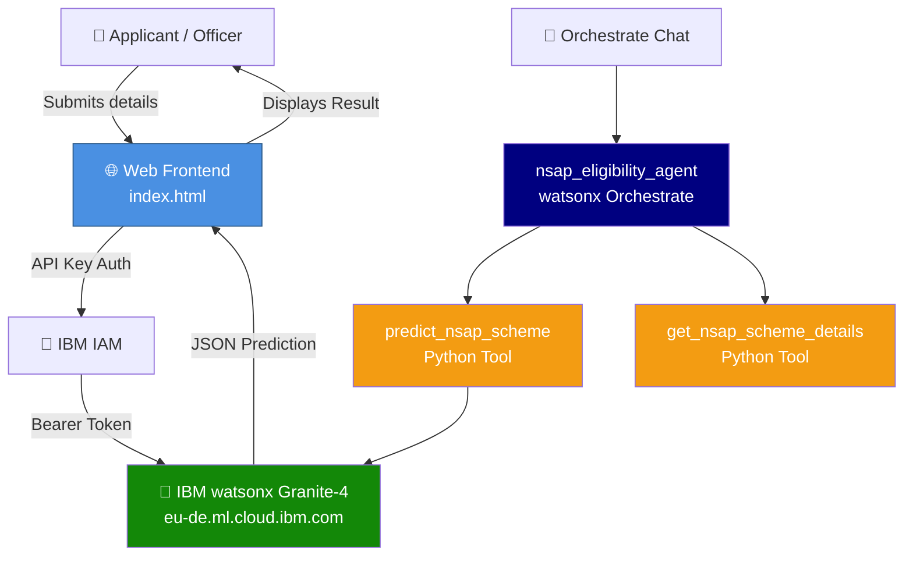
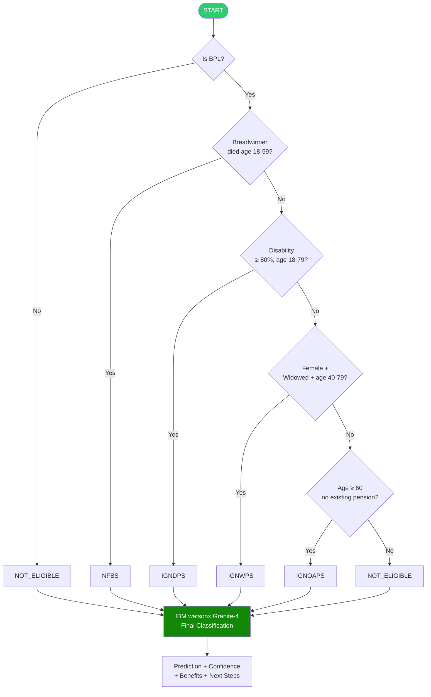

Here's the complete README content ready to paste directly into your GitHub repository:

---

```markdown
# NSAP Eligibility Predictor 🇮🇳

> AI-powered welfare scheme classification using IBM watsonx Granite-4 · Problem Statement 34

---

## Objective

To build an AI-powered web application that automates eligibility prediction for India's **National Social Assistance Programme (NSAP)** schemes — IGNOAPS, IGNWPS, IGNDPS, and NFBS — using a hybrid classification approach combining deterministic rule-based logic with **IBM watsonx Granite-4** large language model inference. The system assists government officials and applicants in accurately and efficiently determining the most appropriate welfare scheme based on demographic and socio-economic inputs, reducing manual processing time and minimizing mis-allocation of social benefits to BPL households.

---

## Problem Statement

The National Social Assistance Program (NSAP) is a flagship social security and welfare program by the Government of India. It aims to provide financial assistance to the elderly, widows, and persons with disabilities belonging to below-poverty-line (BPL) households.

Manually verifying applications and assigning the correct scheme is time-consuming and error-prone. This project solves that by building a **multi-class classification model** that predicts the most appropriate NSAP scheme for an applicant based on their demographic and socio-economic data.

---

## NSAP Schemes Covered

| Code | Scheme Name | Beneficiary | Central Benefit |
|------|-------------|-------------|-----------------|
| `IGNOAPS` | Indira Gandhi National Old Age Pension | BPL citizens, age ≥ 60 | ₹200–₹500/month |
| `IGNWPS` | Indira Gandhi National Widow Pension | BPL widows, age 40–79 | ₹300/month |
| `IGNDPS` | Indira Gandhi National Disability Pension | BPL, disability ≥ 80%, age 18–79 | ₹300/month |
| `NFBS` | National Family Benefit Scheme | BPL, breadwinner died age 18–59 | ₹20,000 one-time |
| `NOT_ELIGIBLE` | Not Eligible | Does not meet any criteria | — |

---

## Architecture



---

## Classification Flow



---

## Project Structure

```
nsap_eligibility/
├── tools/
│   ├── nsap_predictor.py         # Main prediction tool (watsonx Granite-4 + rule-based)
│   └── nsap_scheme_details.py    # Scheme information tool
├── agents/
│   └── nsap_eligibility_agent.yaml  # watsonx Orchestrate agent config
├── frontend/
│   └── index.html                # Standalone web frontend
├── .env.example                  # Environment variable template
├── import-all.sh                 # Orchestrate deployment script
└── README.md
```

---

## Tech Stack

| Layer | Technology |
|-------|-----------|
| AI Model | IBM watsonx Granite-4 (`ibm/granite-4-h-small`) |
| Cloud Platform | IBM Cloud — EU Frankfurt region |
| Agent Platform | IBM watsonx Orchestrate |
| Backend Tools | Python 3, `python-dotenv`, `requests`, `pydantic` |
| Frontend | Vanilla HTML + CSS + JavaScript |
| Auth | IBM IAM (API Key → Bearer Token) |
| Version Control | GitHub |

---

## Environment Variables

Copy `.env.example` to `.env` and fill in your values:

```env
IBM_CLOUD_API_KEY=your-ibm-cloud-api-key
PROJECT_ID=your-watsonx-project-id
WATSONX_AI_ENDPOINT=https://eu-de.ml.cloud.ibm.com/ml/v1/text/generation?version=2023-05-29
WXO_INSTANCE_URL=https://api.eu-de.watson-orchestrate.cloud.ibm.com/instances/<id>
MODEL_ID=ibm/granite-4-h-small
```

---

## Deployment

### Option A — Web Frontend
Open `nsap_eligibility/frontend/index.html` directly in any browser.

### Option B — watsonx Orchestrate Agent
```bash
# Activate environment
orchestrate env activate <your-env-name> --api-key <your-api-key>

# Import tools and agent
cd nsap_eligibility
chmod +x import-all.sh
./import-all.sh

# Start chat
orchestrate chat start
# Select: nsap_eligibility_agent
```

---

## Sample Predictions

| Applicant | Age | Gender | Condition | BPL | Predicted |
|-----------|-----|--------|-----------|-----|-----------|
| Ramesh Kumar | 70 | Male | None | ✅ | **IGNOAPS** |
| Sunita Devi | 65 | Female | Widowed | ✅ | **IGNWPS** |
| Ravi Singh | 35 | Male | 85% disability | ✅ | **IGNDPS** |
| Priya Sharma | 30 | Female | Breadwinner died (42) | ✅ | **NFBS** |
| Anil Gupta | 45 | Male | None | ❌ | **NOT_ELIGIBLE** |

---

## Dataset

- **Source**: [AIKosh — District Wise Pension Data](https://aikosh.indiaai.gov.in/web/datasets/details/district_wise_pension_data_und)
- **Provider**: India AI — Government of India
- **Purpose**: District-level NSAP beneficiary statistics for model context and validation

---

## Apply Online

Official NSAP application portal: **[nsap.nic.in](https://nsap.nic.in)**

---

> This tool is for assistance only. Final eligibility is subject to official verification by the competent authority.
```
