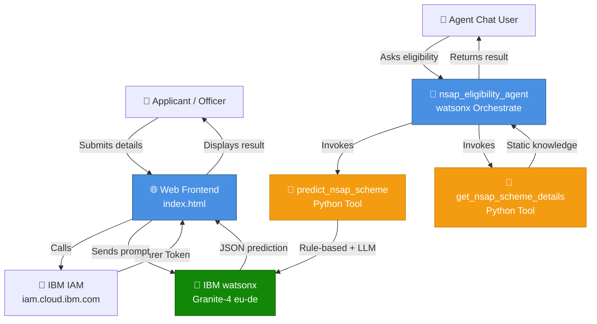
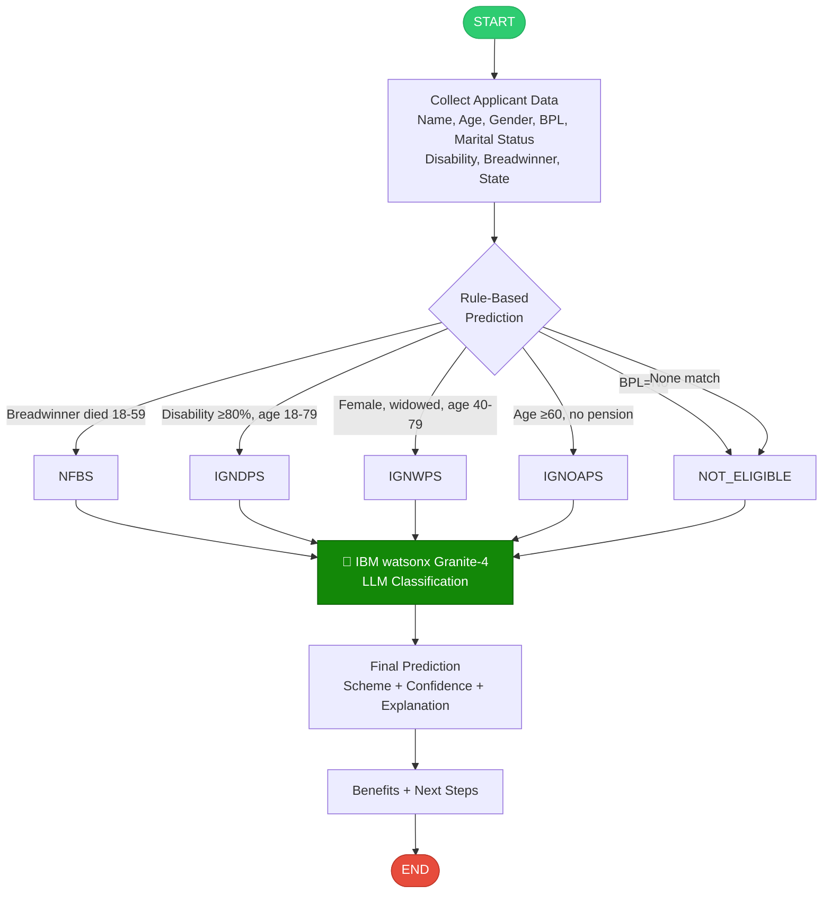

# NSAP Eligibility Predictor

**Problem Statement 34** — Predicting Eligibility for NSAP using Machine Learning  
**Technology**: IBM watsonx Granite-4 · IBM Cloud EU-DE · watsonx Orchestrate

---

## Overview

An AI-powered multi-class classification system that predicts the most appropriate
**National Social Assistance Programme (NSAP)** scheme for applicants based on their
demographic and socio-economic data. Uses a **hybrid approach**: deterministic rule-based
classification + IBM watsonx Granite-4 LLM reasoning.

### NSAP Schemes Covered (5 classes)

| Code | Full Name | Beneficiary |
|------|-----------|-------------|
| `IGNOAPS` | Indira Gandhi National Old Age Pension | BPL elderly, age ≥ 60 |
| `IGNWPS` | Indira Gandhi National Widow Pension | BPL widows, age 40–79 |
| `IGNDPS` | Indira Gandhi National Disability Pension | BPL disabled (≥80%), age 18–79 |
| `NFBS` | National Family Benefit Scheme | BPL families on breadwinner death |
| `NOT_ELIGIBLE` | Not Eligible | Does not meet any NSAP criteria |

---

## Architecture



---

## Classification Flow



---

## Project Structure

```
nsap_eligibility/
├── tools/
│   ├── nsap_predictor.py        # Main ML prediction tool (watsonx Granite-4)
│   └── nsap_scheme_details.py   # Scheme information tool
├── agents/
│   └── nsap_eligibility_agent.yaml
├── frontend/
│   └── index.html               # Full standalone web frontend
├── import-all.sh                # Orchestrate deployment script
└── README.md
```

---

## IBM Cloud Services Used

| Service | Usage |
|---------|-------|
| **IBM watsonx.ai** | Granite-4 LLM for classification |
| **IBM IAM** | API key authentication |
| **watsonx Orchestrate** | Agent deployment & conversational UI |

- **Model**: `ibm/granite-4-h-small` (set via `MODEL_ID` env var)
- **Region**: EU Frankfurt (`eu-de.ml.cloud.ibm.com`)
- **Project ID**: set via `PROJECT_ID` env var (see `.env.example`)

---

## Deployment

### Option A: watsonx Orchestrate Agent
```bash
cd nsap_eligibility
chmod +x import-all.sh
./import-all.sh
orchestrate chat start
# Select: nsap_eligibility_agent
```

### Option B: Web Frontend
Open `frontend/index.html` directly in a browser — it calls IBM watsonx directly from the browser.

---

## Dataset

- **Source**: [AIKosh — District Wise Pension Data](https://aikosh.indiaai.gov.in/web/datasets/details/district_wise_pension_data_und)
- **Provider**: India AI — Government of India
- **Use**: District-level NSAP beneficiary statistics for model context

---

## Example Predictions

| Applicant | Age | Gender | BPL | Condition | Predicted Scheme |
|-----------|-----|--------|-----|-----------|-----------------|
| Ramesh Kumar | 68 | Male | Yes | None | **IGNOAPS** |
| Sunita Devi | 52 | Female | Yes | Widowed | **IGNWPS** |
| Ravi Singh | 35 | Male | Yes | 85% disability | **IGNDPS** |
| Priya Sharma | 30 | Female | Yes | Breadwinner died (42) | **NFBS** |
| Anil Gupta | 45 | Male | No | None | **NOT_ELIGIBLE** |
